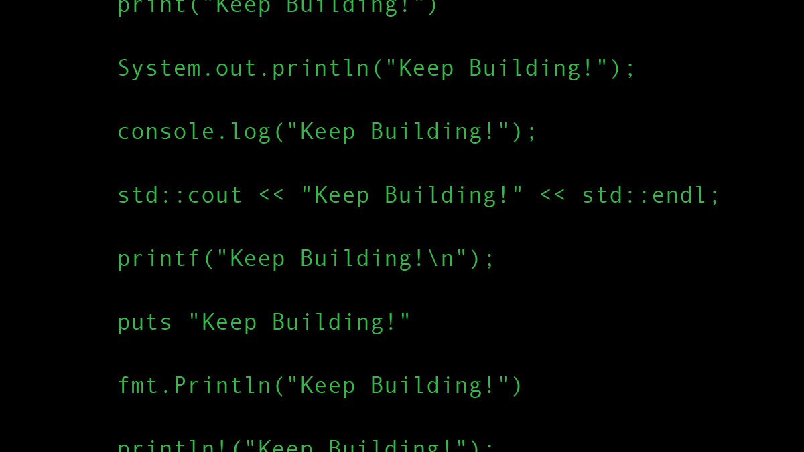

When I was learning programming during my Bachelor’s degree, one lesson stood out above all: it wasn’t about memorizing syntax—it was about mastering the underlying concepts.  

Before we ever wrote a single line of code, we spent time understanding how computers and the internet actually work. At first, it felt like a detour—why not jump straight into coding?  

But as we moved through object-oriented programming, data structures, operating systems, assembly language, algorithms, and software engineering, that early foundation revealed its true value.

---

Among those foundational ideas, **abstraction** proved to be one of the most powerful.  

Abstraction lets you hide messy, low-level details behind a simple interface—whether that’s a for-loop, a function call, or an API—so you can focus on higher-level logic.  

And in a very real sense, writing code is about **communicating** with a machine: just as human languages use different words or idioms to express the same idea, programming languages use different syntax to convey the same underlying operations.

---

---

Fast forward to today, and **generative AI** has made syntax an even smaller barrier.  

Tools like ChatGPT can translate code from Python to JavaScript or Go in seconds. They can help you build front ends in React, write CUDA kernels, or scaffold a machine-learning model in TensorFlow or PyTorch.  

But while AI can handle syntax, it can’t replace your understanding of core concepts.

---

If you grasp how loops work, how memory is managed, or how UI components update in a framework like React, you’ll be able to craft more precise prompts and make sense of the generated code.  

The same applies when switching between languages or libraries: once you understand the underlying ideas—variables, control flow, memory management, or neural-network abstractions—you’ll find it easy to move from JavaScript to TypeScript, from C++ to Java, or from TensorFlow to PyTorch.

---

The real edge in today’s world isn’t knowing every programming language—it’s knowing how to think like a developer.  

If you can do that, the syntax is just the final detail.  

With AI tools in the mix, it’s the thinking, not the typing, that counts.
