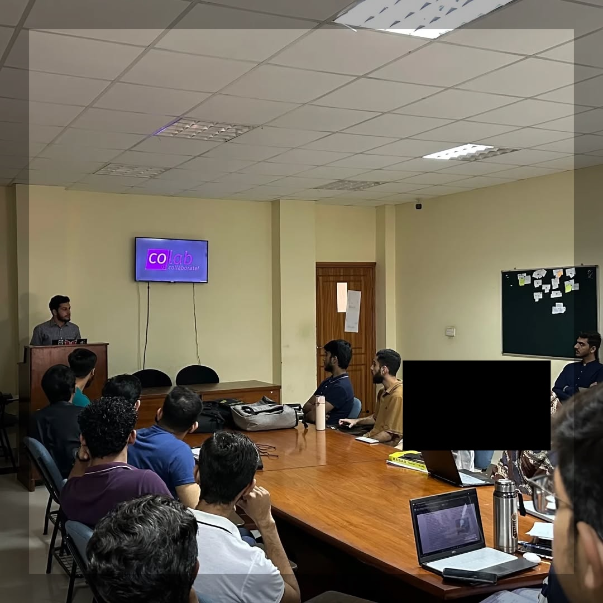
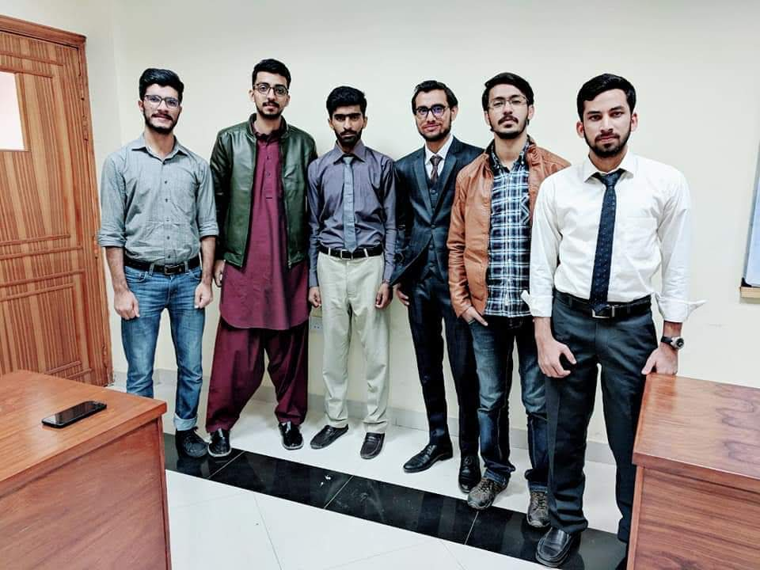

We’ve all had those moments — a spark, an unexpected encounter, or a place that quietly changes the trajectory of your life. For me, that place was COLAB.

In a previous blog post, I briefly mentioned COLAB while talking about communication skills. But honestly, a footnote doesn’t do it justice. This initiative wasn’t just a side project during my undergrad years — it was a turning point. It shaped how I think, how I work, and even how I show up in professional spaces like IBM today.

## Growth in Action

COLAB is a research and learning space at FAST NUCES Peshawar. It was launched in 2017 by Dr. Mohammad Nauman — a name that comes up often in my story for good reason. His vision was clear and refreshingly simple: build a space where students from different academic years could come together, share ideas, and grow — not through rigid structures, but through curiosity and collaboration.

There were no exams. No grades. No "outcomes." Just one requirement: be present.

Each week, students would share what they were working on. These presentations — casual and often impromptu — created a ripple effect of knowledge-sharing. A first-year student could learn Linux tricks from a senior; a third-semester coder could get feedback on a web app from someone who had built something similar last month. It was fluid, honest, and surprisingly effective.

I’ll never forget my first presentation. I was nervous, underprepared, and honestly? It was a mess. But no one laughed. No one dismissed me. Instead, I got questions, suggestions, and a reason to do better next time.

And I did.

Week after week, I presented. Slowly, that shaky voice became steadier. I went from barely managing 5-minute talks to confidently speaking in front of 100+ people. That kind of growth doesn’t come from textbooks — it comes from being part of a community that expects your best and supports you on the way there.

By the end of our second semester, we were already building web apps. Linux became second nature — and yes, I’ll say it: if you’re still clinging to Windows and calling yourself a developer... we need to talk 😄.

By our fourth and fifth semesters, we were exploring cloud computing, DevOps pipelines, and functional programming — way ahead of the formal curriculum. We weren’t just learning; we were applying.

We even hosted workshops on DevOps and web development. And these weren’t senior projects — they were led by students in their fourth semester. That’s the kind of confidence COLAB instilled in us.

  
*A student presenting in a COLAB session.*

## The Ripple Effect

The results spoke for themselves. Many of us started freelancing or working part-time while still in university. Some internships turned into long-term jobs. Others who weren’t part of COLAB saw what we were doing, got inspired, and started learning and applying the same skills on their own — even though they never actually joined the space.

By the time graduation rolled around, about 90% of our batch already had job offers in hand. That stat alone is a testament to what’s possible when learning is driven by passion rather than pressure.

## Why COLAB Still Matters

Fast forward to my time at IBM, and I started seeing echoes of COLAB in the professional world. Agile teams, peer learning, internal communities — these concepts are gaining ground in global organizations. And it’s not just a trend. It works.

COLAB wasn’t a one-off experiment. It was a living model of how freedom, collaboration, and purpose can lead to powerful outcomes. And I truly believe that if more institutions and companies adopted this mindset, they’d unlock the same magic.

## A Lesson Worth Sharing

If there’s one thing COLAB taught me, it’s this: when the right people come together with the right intent, incredible things can happen. It didn’t require fancy labs or big budgets. It just needed trust, time, and the willingness to learn — together.

And maybe that’s the most important lesson of all. Whether you’re a student, a team lead, or just someone trying to get better at what you do — seek out (or create) your own COLAB. The results might surprise you.

  
*A group photo after System Adminstration Workshop on GitHub Local Hackday in 2018*

